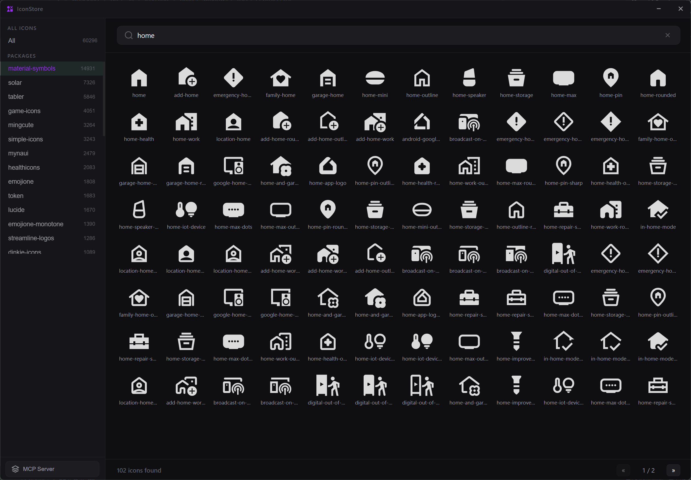
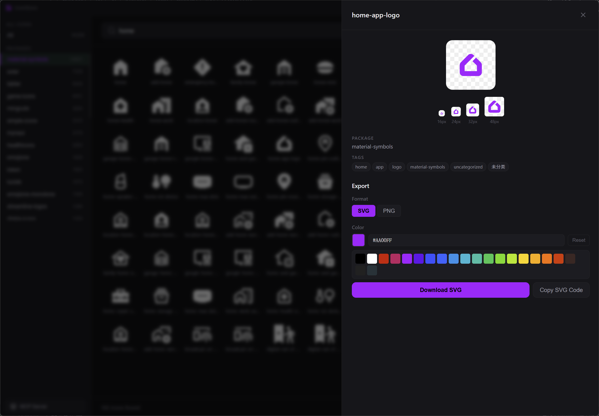
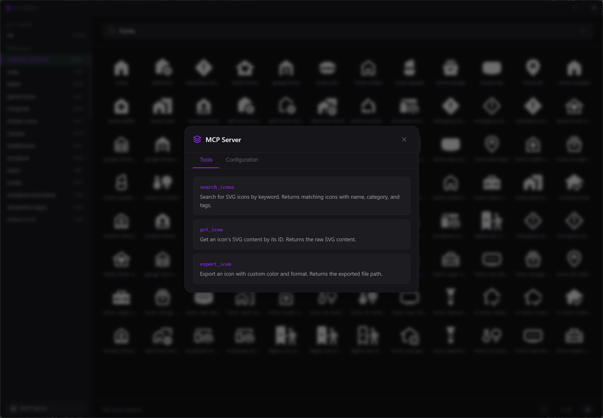

<p align="center">
  
</p>

<h1 align="center">IconStore</h1>

<p align="center"><a href="README.md">English</a> | 中文</p>

<p align="center">
一个跨平台的 SVG 图标搜索、浏览和下载工具，基于 <a href="https://v3.wails.io/">Wails v3</a>（Go + Vue 3）构建。<br>
内置 SQLite 数据库支持全文搜索，集成 MCP 服务器可接入 AI 助手使用。
</p>

## 截图

<p align="center">
  
</p>
<p align="center">
  
</p>
<p align="center">
  
</p>

## 功能特性

- **图标搜索** — 内置 60,000+ 图标，基于 SQLite FTS5 全文检索
- **分类浏览** — 侧边栏按包名/分类层级浏览图标库
- **多尺寸预览** — 在 16/24/32/48px 多种尺寸下实时预览图标，支持自定义颜色
- **导出下载** — 支持 SVG/PNG 格式导出，可自定义尺寸和颜色，调用系统原生保存对话框
- **复制 SVG** — 一键复制 SVG 源代码到剪贴板
- **MCP 服务器** — 内置 MCP 服务（端口 9393），可接入 Claude Desktop、Cursor 等 AI 工具
- **跨平台** — 通过 Wails v3 支持 Windows、macOS 和 Linux

## 技术栈

| 层级 | 技术 |
|------|------|
| 后端 | Go、SQLite (modernc.org/sqlite)、FTTS5 |
| 前端 | Vue 3、Vite |
| 桌面框架 | Wails v3 |
| SVG 渲染 | oksvg + rasterx（PNG 导出） |

## 快速开始

### 环境要求

- [Go](https://go.dev/dl/) >= 1.25
- [Node.js](https://nodejs.org/)（用于前端构建）
- [Wails v3 CLI](https://v3.wails.io/)

### 开发模式

```bash
wails3 dev
```

### 构建

```bash
wails3 build
```

### MCP 独立模式

以 MCP 服务器模式运行（无 GUI）：

```bash
iconstore --mcp          # 默认端口 9393
iconstore --mcp 8080     # 自定义端口
```

## MCP 集成

桌面应用启动时会自动启动内置 MCP 服务器，也可以通过 `--mcp` 参数独立运行。

### 可用工具

| 工具 | 说明 |
|------|------|
| `search_icons` | 按关键词搜索图标，支持分类过滤和分页 |
| `get_icon` | 根据图标 ID 获取 SVG 源码 |
| `export_icon` | 导出图标为 SVG 或 PNG，支持自定义颜色和尺寸 |

### 客户端配置

将以下内容添加到 MCP 客户端配置中（如 Claude Desktop、Cursor）：

```json
{
  "mcpServers": {
    "iconstore": {
      "url": "http://127.0.0.1:9393/mcp"
    }
  }
}
```

## 项目结构

```
├── main.go              # 入口文件，桌面应用 & MCP 服务器启动
├── icon_service.go      # 图标搜索、导出、SQLite 管理
├── mcp_server.go        # MCP JSON-RPC 服务器实现
├── dialog_service.go    # 原生文件保存对话框
├── iconstore.db         # SQLite 数据库（图标 + FTS 索引）
├── frontend/
│   ├── src/
│   │   ├── App.vue             # 主布局，包含搜索和分页
│   │   ├── components/
│   │   │   ├── IconGrid.vue    # 图标网格展示
│   │   │   ├── IconDetail.vue  # 图标详情面板（导出选项）
│   │   │   ├── SearchBar.vue   # 搜索输入框
│   │   │   ├── Sidebar.vue     # 包名/分类导航
│   │   │   ├── SubCategories.vue
│   │   │   ├── TitleBar.vue    # 自定义无边框标题栏
│   │   │   ├── MCPDialog.vue   # MCP 配置对话框
│   │   │   └── Toast.vue       # 通知提示
│   │   └── main.js
│   ├── bindings/               # Wails 自动生成的 JS 绑定
│   └── package.json
├── build/                      # 各平台构建配置
│   ├── windows/
│   ├── darwin/
│   ├── linux/
│   ├── android/
│   └── ios/
└── Taskfile.yml
```

## 许可证

本项目使用的图标来自多个开源图标库，具体请参阅各图标的原始许可证。
